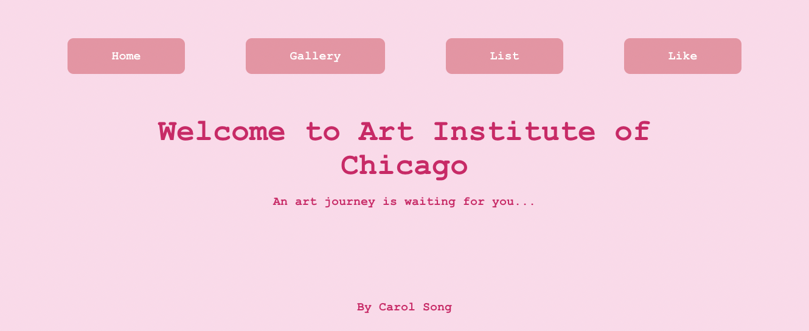

To run the project you could type the following command in terminal.

### `npm start`

Runs the app in the development mode.\
Open [http://localhost:3000](http://localhost:3000) to view it in the browser.

This Web APP also deployed through gitlab.